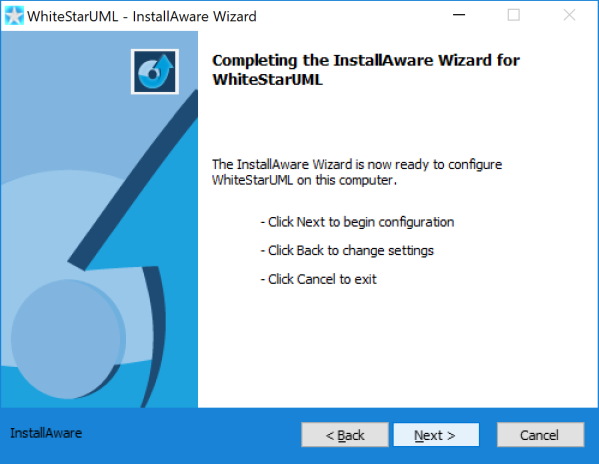

# staruml-nucleus
(White)StarUML extensions for Astares Nucleus

# Info

This project includes UML extensions for the free WhiteStarUML Tool to allow easy working with the Astares Nucleus project. It follows the [StarUML developers guide for UML Profiles](http://staruml.sourceforge.net/docs/developer-guide(en)/ch07.html). 

# Installation

## Installation of WhiteStarUML

### 1. Create a local directory for the tools

```
C:\astares\tools
```

Make sure you name the root directory **astares** with a subdirectory **tools** as this used later for various components to work.

### 2. Download and install WhiteStar UML for Windows

Download WhiteStar UML for Windows 64 bit:

- [WhiteStarUMLSetup-5.9.1.exe](https://sourceforge.net/projects/whitestaruml/files/WhiteStarUMLSetup-5.9.1.exe/download)

and execute the downloaded **WhiteStarUMLSetup-5.9.1.exe** file.

Now follow the single steps to install the tool:

#### Installation - Welcome


#### Installation - Setup Type


#### Installation - Installation folder

By default WhiteStarUML installation wizard suggests to install the program into the program folder of your Windows system. 


Unfortunately with this default it is not possible to modify and add files within the WhiteStarUML installation afterwards without specific administrative rights. Therefore we will install the tool into a custom folder - so please ignore this default installation path and install the tool into the following path

```
C:\astares\tools\WhiteStarUML
```


#### Installation - Shortcuts


#### Installation - Completion



The installer will now copy the files of WhiteStarUML installation to your hard disk:


When the setup is done you can click on **Finish** and run the UML tool 


## Installation of staruml-nucleus extension

Clone this project folder into your WhiteStarUML **modules** folder which is part of the WhiteStarUML installation

```
cd C:\astares\tools\WhiteStarUML\modules
git clone git clone https://github.com/astares-nucleus/staruml-nucleus.git
```


Now you can restart WhiteStarUML and use the Nucleus profile.

# Quick Start

Within (White)StarUML choose **Profile** and **Astares Nucleus Profile** 
